# Start2Impact FullStack Project

- Online course site.
- License: MIT

## Features

- CRUD operations for lessons, master and courses.
- Authentication and authorization.
- Account verification.
- Password reset.
- Role based access control.
- Cache management.
- Simple and easy to use UI and UX.
- Organized and understandable app structure.
- Responsive design.

## Demo

Link: https://demo8.isaccobertoli.com

## Tech Stack Client

- React
- React Router DOM
- Redux Toolkit
- Tailwind CSS
- Lucide React

## Tech Stack Server

- Node JS
- Express JS
- MongoDB
- JWT Auth
- Express Validator
- Nodemailer
- Multer

## Screenshots

- Home | Master

<div style="display: flex; flex-direction: row; justify-content: space-between; gap: 10px; margin-bottom: 10px">
    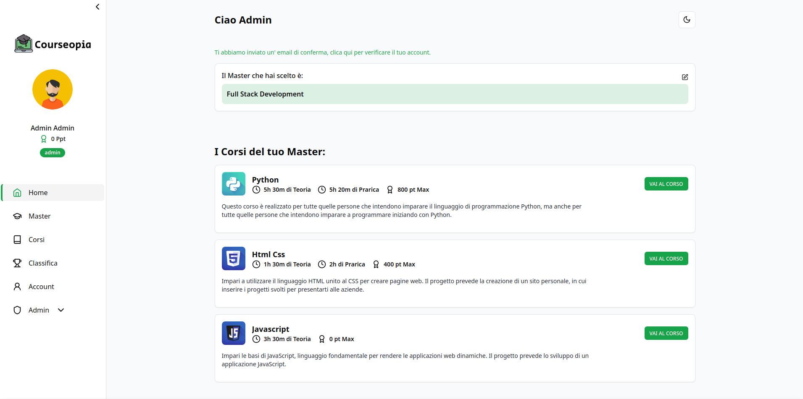
    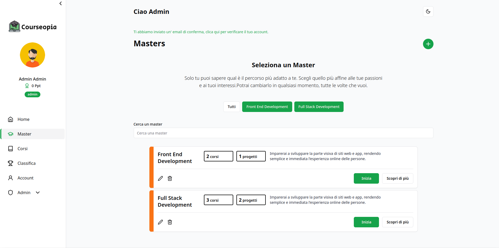
</div>

- Course | Lessons

<div style="display: flex; flex-direction: row; justify-content: space-between; gap: 10px; margin-bottom: 10px">
    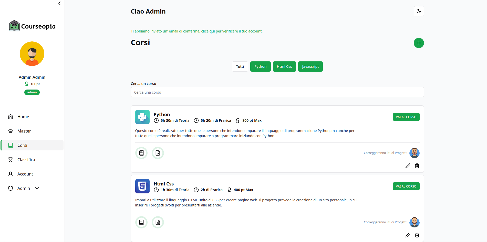
    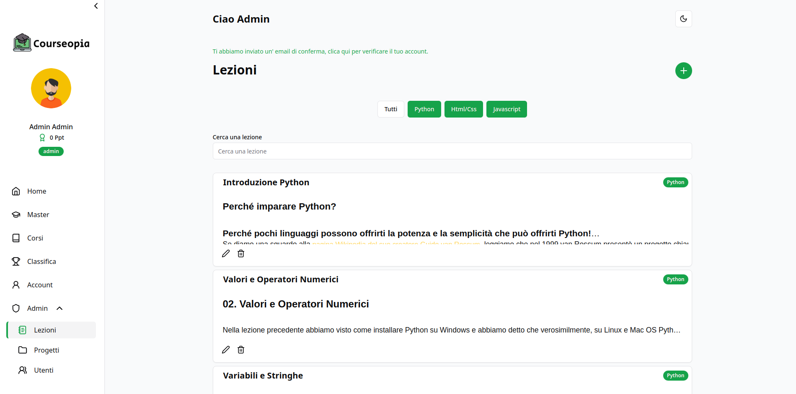
</div>

- Leaderboard | Users

<div style="display: flex; flex-direction: row; justify-content: space-between; gap: 10px; margin-bottom: 10px">
    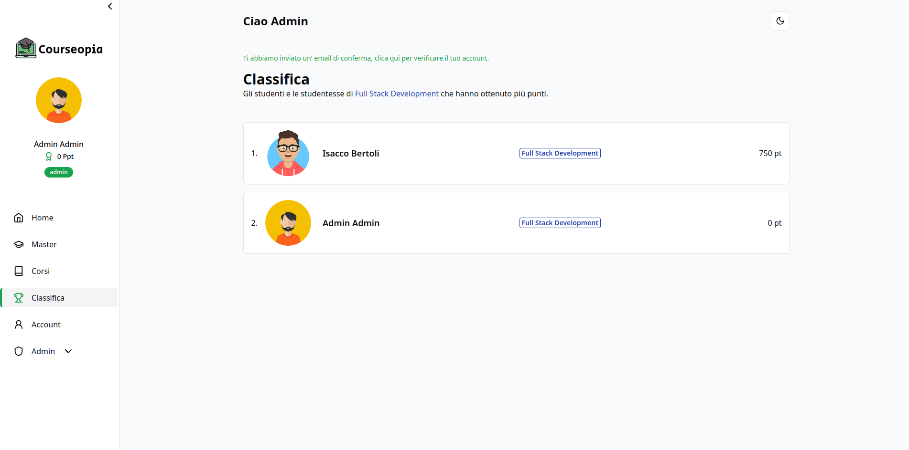
    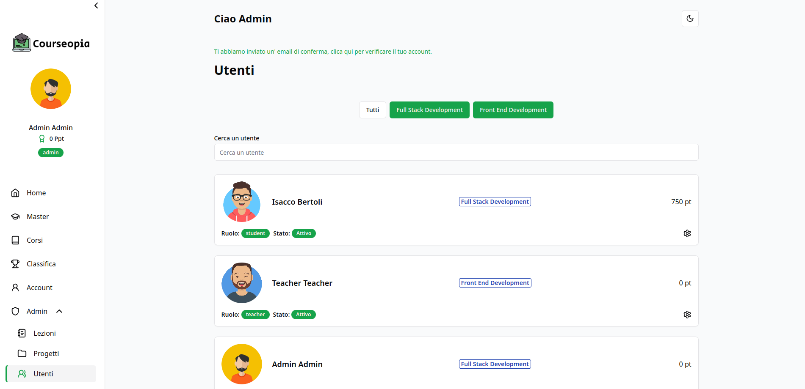
</div>

- Course Detail | Project

<div style="display: flex; flex-direction: row; justify-content: space-between; gap: 10px; margin-bottom: 10px">
    
    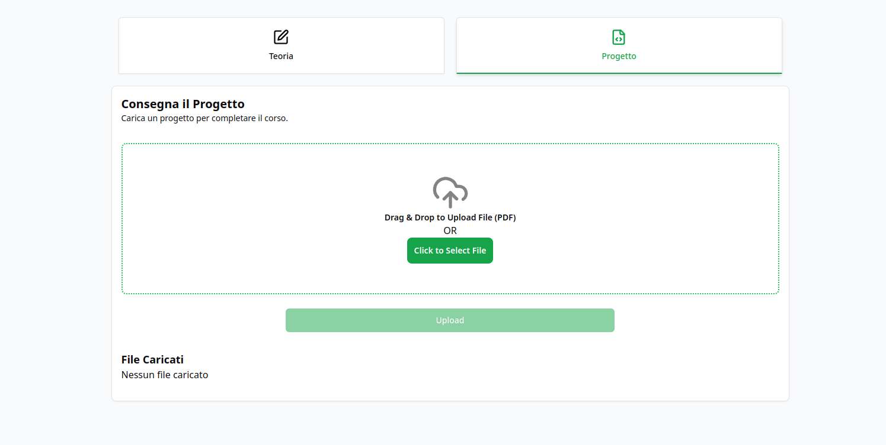
</div>

- Projects | Create form

<div style="display: flex; flex-direction: row; justify-content: space-between; gap: 10px; margin-bottom: 10px">
    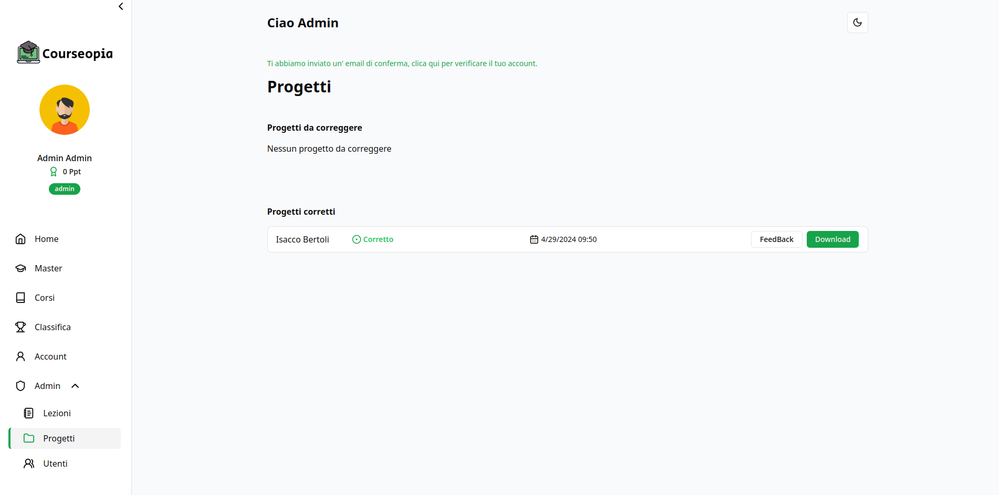
    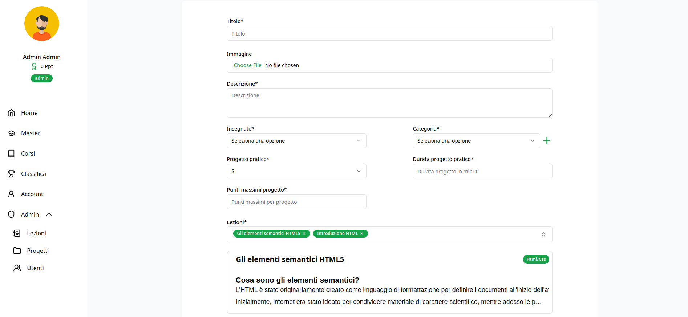
</div>

- Dark mode | Responsive Design

<div style="display: flex; flex-direction: row; justify-content: space-between; gap: 10px; margin-bottom: 10px">
    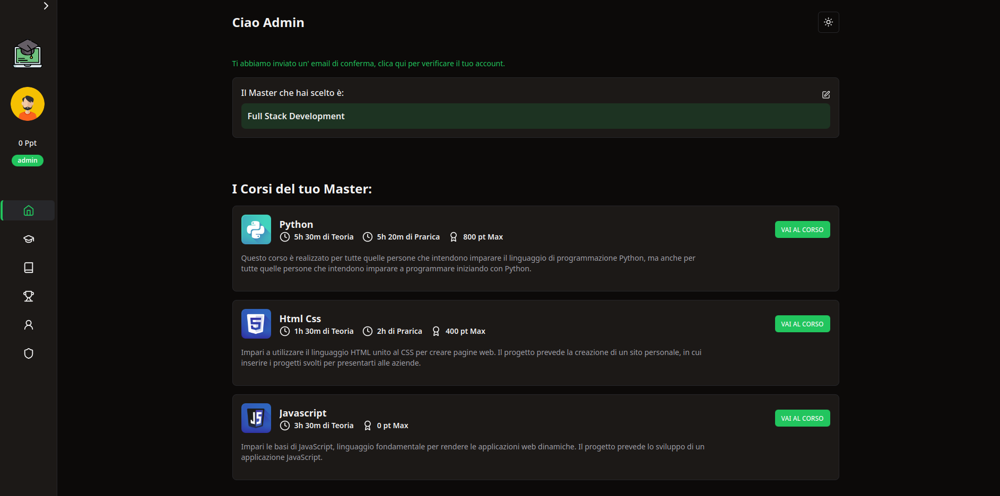
    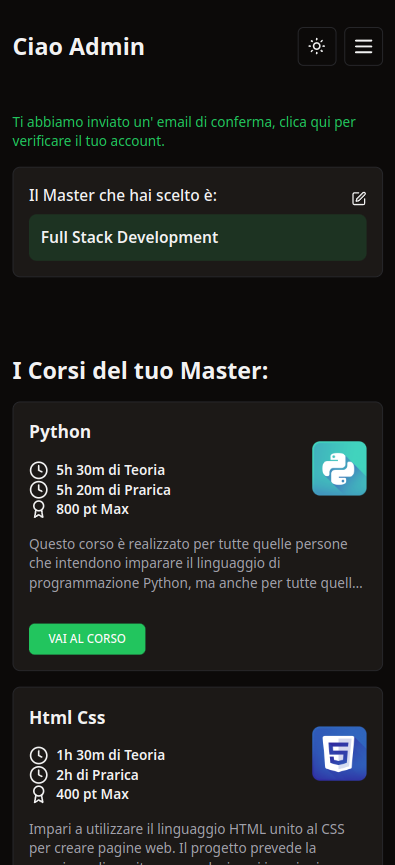
</div>

## Getting Up and Running Locally

### Clone Repo

```bash
git clone https://github.com/Isacco-B/Start2Impact_Progetto_Finale_FullStack.git
```

### Create .env File for the client and server folder.

- Set the following environment variables in the api folder:
```bash
NODE_ENV= //development
PORT= //3000
DB_HOST= //mongodb://localhost:27017/dbName

#require("crypto").randomBytes(64).toString("hex")
JWT_SECRET= //34bcb60ebf3953b598e56519e3718b930b7c2c6da629c63d0cf778a3338640459852b27edb2c165fe7484e71027353ca3880c12ecbd7d288e26092
ACCESS_TOKEN_SECRET= //9e9e24b156eddc2afc88c8f155a79904e09114a088b7173114c23c2e85475c5be709865c0b499fd658f481dfb8b3be9cf55a11760cf2ecfdfc93ef
REFRESH_TOKEN_SECRET= //68c25dc9f1c719b5bfd24df765db7fcb64fcb2bb26e6fb5edf265dd10529a34d5450f6643c34c044942954fe7822d1117d7a11c37bef883af4cce1e3f8
PASSWORD_TOKEN_SECRET= //5dc9417ba2592647ac735fd99d9ba27ad52b40473dfab2bcd65df4bd2d916c55b1955dd7d763cc2576e2a98a427e0df9843c8106faea597e82466be2a8f8

EMAIL_HOST= //yourSMTP
EMAIL_NAME= //yourDomain
EMAIL_ADDRESS= //yourDomain
EMAIL_PASSWORD= //yourPassword
EMAIL_PORT= //465
EMAIL_SECURITY= //STARTTLS
```

- Set the following environment variables in the client folder:
```bash
NODE_ENV=development
```

### Install dependencies for each folder

```bash
npm install
```

### Run development server and client

```bash
npm run dev
```

## 🔗 Links

[](https://www.linkedin.com/in/isacco-bertoli-10aa16252/)
